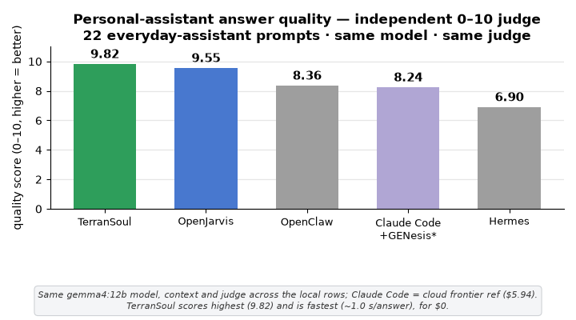
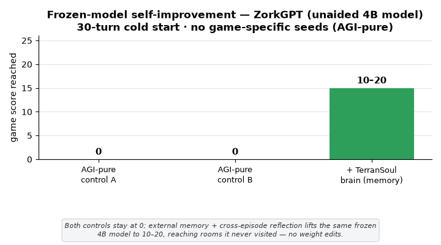

# TerranSoul — a 3D AI companion that remembers, and runs on your own machine

> **A first-class external memory you can plug into any AI.** Private, local, **$0** — it remembers across sessions, and shares one brain with your other AI tools over MCP.

> **🚧 In active development since 10 April 2026.** Interested? Join us at <https://discord.gg/RzXcvsabKD>

> This is the public **information & GitHub Pages** repository for TerranSoul — what it is, why it exists, and the research + benchmarks behind it.

TerranSoul keeps your language model **frozen** and makes the **memory around it** smarter — so a small local model behaves above its weight class, every change is auditable, and your knowledge stays **portable data, not opaque weights**. One brain, shared over MCP with your other AI tools.

**[📖 TerranSoul in Six Scenes](https://terranimus.github.io/TerranSoul/)** — a non-technical primer · **[📄 Research — *From Memo to Memory*](https://terranimus.github.io/TerranSoul/LLM-Brain-Design-Research-Paper/)** — the thesis, with receipts.

---

## The problem

Most AI assistants forget everything when you close the tab, send your data to the cloud on every call, and charge a monthly subscription for it.

## Memory-first, by design

TerranSoul runs on your own machine: local models on your own hardware for **$0**, data that never leaves your device, and persistent offline memory that picks up where you left off. It shares one brain over MCP, so your *other* AI tools (Claude Code, Copilot, Cursor, Codex, peer instances) get smarter too.

## A first-class memory you can plug in anywhere

TerranSoul is a **first-class external memory** — built for knowledge representation, retrieval, and updating, the way a brain organizes and revises what it knows: a typed knowledge graph, three decaying memory tiers, hybrid retrieval, and a closed write → manage → read loop. The language model stays **frozen**; the memory does the learning, so gains are auditable and reversible because they live in data, not model weights.

That makes TerranSoul a different kind of tool than Claude Code, OpenClaw, or SIA — none of those are memory-first. They are coding agents and self-improvement loops; TerranSoul is the memory substrate they plug into over MCP, and its sweet spot is memory-heavy read + update: long-lived, cross-session, cross-tool knowledge that has to stay correct as it changes. The benchmarks below show where a memory-first system lands — highest on the memory axis it was built for, and competitive even on tasks designed for the others.

---

## Benchmark Results

> Measured, chart-by-chart: a memory / retrieval head-to-head vs ~20 systems ([`COMPARISON.md`](benchmark/COMPARISON.md)) and **[SIA](https://github.com/hexo-ai/sia)'s own benchmark suite** run on a **permanently frozen** model — memory + iteration only, **no weight training** ([`SELF-IMPROVE-COMPARISON.md`](benchmark/SELF-IMPROVE-COMPARISON.md)). The only estimate is the labeled H100 projection.

 
<i><b>Memory recall — LongMemEval-S</b> (500 questions): R@5 <b>98.6%</b> · R@10 <b>99.8%</b> · R@20 <b>100%</b> — the top score in the table (agentmemory 95.2%, MemoryPalace ~96.6%). SIA ships no memory subsystem.</i>

 
<i><b>Personal-assistant answer quality</b> (22 prompts, independent 0–10 judge, same model): TerranSoul <b>9.82</b> at <b>~1.0 s</b> for <b>$0</b> — the highest and fastest local row.</i>

 
<i><b>Frozen-model self-improvement — ZorkGPT</b> (4 B model): memory alone lifts the score from <b>0</b> (both AGI-pure controls) to <b>10–20</b>, reaching rooms it never visited. No weight edits.</i>

 
<i><b>LawBench</b> (191-class charge prediction): frozen 12 B + memory <b>76.3%</b> Top-1, above SIA's weight-trained 120 B (70.1%) and prior SOTA (45%); DeepSeek-v4-pro frozen reaches <b>80.0%</b>.</i>

 
<i><b>AlphaFold-3 TriMul kernel</b>: a frozen agent reaches <b>3.87×</b> over fp32 (RTX 3080 Ti) → <b>~14–15× H100-estimated</b> ≈ SIA's <b>14×</b>. The H100 figure is an estimate (re-bench TODO).</i>

 
<i><b>scRNA-seq denoising</b>: a real frozen-actor denoiser on PBMC3k, raw MSE <b>0.046 (+35%)</b>. A raw scale, not SIA's normalized 0.289 — indicative, not a head-to-head bar.</i>

 
<i><b>OpenAI MLE-Bench Hard</b>: SIA ranks <b>#1</b>; not run on TerranSoul — needs the MLE-Bench harness, Kaggle data, and multi-hour GPU runs (a truthful blocker, not a fabricated number).</i>

> Full methodology, per-task tables, and the 18-config embedder audit: [`COMPARISON.md`](benchmark/COMPARISON.md) · [`SELF-IMPROVE-COMPARISON.md`](benchmark/SELF-IMPROVE-COMPARISON.md).

---

## Read the research

TerranSoul's thesis — *memory, not weights* — is defended in a research report, with receipts:

**[📄 From Memo to Memory: A First-Class External-Memory Architecture for Frozen Language Models](https://terranimus.github.io/TerranSoul/LLM-Brain-Design-Research-Paper/)** — a combined position-and-measurement paper. It accepts the *memo-vs-memory* charge in the recent literature and contests the dichotomy: five behavioural criteria separate a memo from a memory, and a structured external substrate can satisfy them with the model's weights frozen — shown on a controlled Zork I study (ZorkGPT × external-memory bench) and four public benchmarks. ([per-turn runs](https://terranimus.github.io/TerranSoul/zorkgpt/))

---

## Contact

**Darren Bui** — [darren.bui@terransoul.com](mailto:darren.bui@terransoul.com)

Interested in becoming a contributor? Join the Discord at <https://discord.gg/RzXcvsabKD> or email Darren directly. Devs, designers, VRM artists, prompt engineers, testers, and non-technical users are all welcome.

Built for the community. MIT License.
