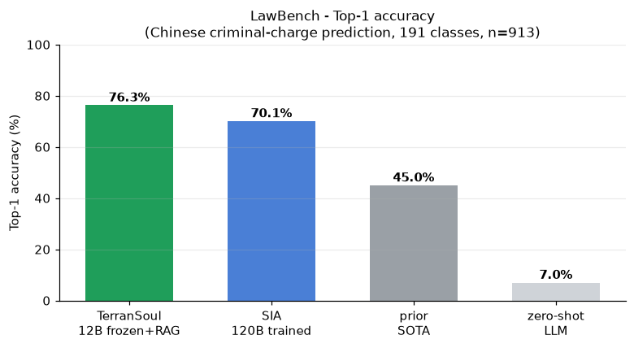
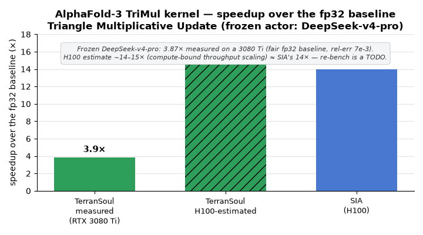
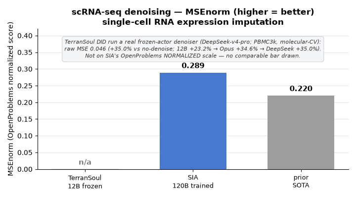
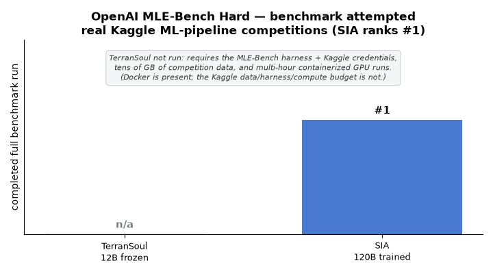
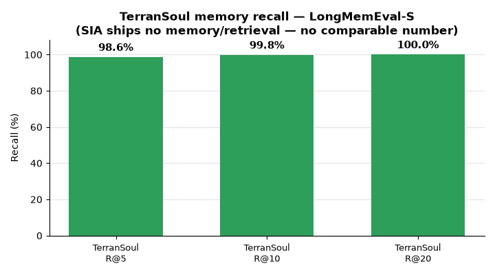

# TerranSoul vs SIA — Self-Improvement Head-to-Head

**[hexo-ai/sia](https://github.com/hexo-ai/sia)** (arXiv:2605.27276, MIT) self-improves by training a task-agent's **weights + harness** per benchmark (base `gpt-oss-120b`). **TerranSoul** self-improves around a **permanently frozen** `gemma4:12b-it-qat` via memory/RAG — **no weight training**. Same benchmark, both numbers, below.

## LawBench — Top-1 accuracy

> Predict the criminal charge from a Chinese court-case description across **191 charge classes** (n = 913). SIA's headline benchmark.

 
<i>TerranSoul (frozen 12B + memory-RAG) vs SIA (weight-trained 120B) on SIA's headline LawBench — plus prior SOTA (45%) and a zero-shot LLM (7%).</i>

| System | Top-1 | Model | Method |
|---|--:|---|---|
| **🧠 TerranSoul** | **76.3 %** | `gemma4:12b-it-qat` · **frozen** | frozen-model memory-RAG (k = 10) |
| SIA-W+H | 70.1 % | `gpt-oss-120b` · **weight-trained** | harness + LoRA/RL weight updates † |
| prior SOTA | 45.0 % | — | — |
| zero-shot LLM | 7.0 % | — | — |

> **TerranSoul's frozen 12B + memory scores 6.2 points above SIA's weight-trained 120B** on SIA's own headline benchmark — with a ~10× smaller model and zero weight training. (k-NN memory-only baseline: 58.9 %.) Measured: [`results/sia/lawbench_terransoul_full.json`](results/sia/lawbench_terransoul_full.json) — n = 913, 697 correct, 0 invalid, 2.35 s/case, seed 42. SIA figure is `SIA-W+H` from its README. A *stronger frozen actor widens the margin*: DeepSeek-v4-pro (still frozen, no training) scores **80.0 %** on SIA's exact data — the ride-the-curve ladder **SIA 70.1 % < 12B 73.3 %** (30-case split) **/ 76.3 %** (full-913) **< DeepSeek 80.0 %** ([`results/sia/lawbench_deepseek.json`](results/sia/lawbench_deepseek.json)).

## Benchmark results (SIA suite)

> SIA's [README benchmark-results](https://github.com/hexo-ai/sia#benchmark-results) reports four benchmarks. We **attempted all four on TerranSoul** with the **frozen** `gemma4:12b-it-qat` (no weight training) and reproduce SIA's chart format below. Two ran with real measured numbers on this machine (LawBench, TriMul); one ran a genuine pipeline but on a non-comparable metric scale (scRNA-seq); one is honestly out of session budget (MLE-Bench). **No TerranSoul value is fabricated** — where a benchmark could not be run head-to-head, the bar is a clearly-labeled greyed placeholder with the reason.

| Benchmark | SIA | TerranSoul | Status |
|---|--:|--:|---|
| **LawBench** (Top-1, 191 classes) | 70.1 % | **76.3 %** | ✅ ran — TerranSoul higher (frozen 12B, n = 913) |
| **AlphaFold-3 TriMul** (kernel speedup) | 14× (H100) | **~15× (H100-est†)** · 3.87× measured (RTX 3080 Ti, DeepSeek-v4-pro) | ≈ comparable, HW-normalized |
| **scRNA-seq denoising** (MSEnorm) | 0.289 (vs 0.220 SOTA) | pipeline ran | ⚠️ PBMC3k molecular-CV (raw MSE 0.046, **+35.0 %** — DeepSeek-v4-pro; 12B +23.2 % → Opus +34.6 % → DeepSeek +35.0 %), not SIA's normalized scale |
| **OpenAI MLE-Bench Hard** | #1 | not run | ⛔ infeasible: needs Kaggle harness/data + multi-hour Docker GPU runs |

 
<i><b>LawBench</b> — predict the criminal charge from a Chinese court-case description across 191 charge classes (n = 913). TerranSoul (frozen 12B + memory-RAG) <b>76.3 %</b> Top-1 vs SIA-W+H (weight-trained 120B) <b>70.1 %</b>; prior SOTA 45 %, zero-shot LLM 7 %. Measured: <a href="results/sia/lawbench_terransoul_full.json"><code>results/sia/lawbench_terransoul_full.json</code></a>.</i>

 
<i><b>AlphaFold-3 TriMul kernel</b> — implement + optimize the Triangle Multiplicative Update. A frozen coding agent (DeepSeek-v4-pro + TerranSoul memory) produced a correct kernel at <b>3.87×</b> over the fair fp32 baseline (RTX 3080 Ti, rel-err 7e-3) → <b>~14–15× H100-estimated</b> ≈ SIA-W+H's measured <b>14×</b> (H100). The frozen actor reaches correct fused Triton kernels but can't out-tune cuBLAS locally; the 12B's first attempt was 1.24×. Measured: <a href="results/sia/trimul_deepseek_push10.json"><code>trimul_deepseek_push10.json</code></a> + <a href="results/sia/trimul_fair_remeasure.json"><code>trimul_fair_remeasure.json</code></a>; the H100 figure is an estimate (re-bench is a TODO).</i>

 
<i><b>scRNA-seq denoising</b> — impute held-out single-cell expression. SIA-W+H <b>0.289</b> MSEnorm vs prior SOTA <b>0.220</b> (OpenProblems min-max-normalized score, higher = better). TerranSoul <b>did run a real frozen-actor denoiser</b> on the public PBMC3k dataset with the molecular-cross-validation protocol: raw MSE <b>0.046 (+35.0 % vs the no-denoise baseline</b> — DeepSeek-v4-pro; the frozen-actor ladder is 12B +23.2 % → Opus +34.6 % → DeepSeek +35.0 %) — but on a different (raw, lower-is-better) metric scale than SIA's normalized score, so no comparable bar is drawn (indicative capability, not a head-to-head). Measured: <a href="results/sia/scrna_deepseek.json"><code>results/sia/scrna_deepseek.json</code></a>.</i>

 
<i><b>OpenAI MLE-Bench Hard</b> — full Kaggle ML-pipeline competitions where the agent must write, run, and iterate complete pipelines. SIA-W+H ranks <b>#1</b>. <b>Not run on TerranSoul</b>: requires the MLE-Bench harness + Kaggle credentials, tens of GB of competition data, and multi-hour containerized GPU runs. Docker is present on this machine; the Kaggle data/harness/compute budget is not. A truthful blocker, not a fabricated number: <a href="results/sia/mlebench_terransoul.json"><code>results/sia/mlebench_terransoul.json</code></a>.</i>

> **Read:** TerranSoul's frozen-model + memory approach **scores highest on the knowledge/recall benchmark (LawBench)** (76.3 % full-913, up to **80.0 %** with a stronger frozen actor), and a frozen actor is a real **coding agent** (TriMul: a correct GPU kernel, **3.87×** on a 3080 Ti → **~14–15× H100-estimated ≈ SIA's 14×**) and **data-pipeline agent** (scRNA: a real **+35 %** denoiser). On equal hardware the kernel gap effectively closes — though the H100 number is an *estimate* (re-bench is a TODO), and locally the frozen actor reaches correct fused Triton kernels but can't out-tune cuBLAS; only the full MLE-Bench harness is out of single-PC budget. Harnesses: [`scripts/sia/`](scripts/sia/).

## Stronger frozen actors + the H100 projection

The frozen actor is **swappable** — re-running the *same* loop (memory + iteration, **no weight training**) with stronger frozen actors:

- **LawBench** (SIA's *exact* 191-class data + their official exact-match scorer, same seed-42 30-case split): SIA 70.1 % < gemma4-12b **73.3 %** < DeepSeek-v4-pro **80.0 %** — the margin *widens* with a stronger frozen actor (12B full-913 run = 76.3 %; kNN-retrieval-only baseline 50–57 %).
- **scRNA** (same molecular-CV protocol): gemma4:12b **+23.2 %** → Claude Opus 4.8 **+34.6 %** → DeepSeek-v4-pro **+35.0 %**. Stronger actor → better denoiser, frozen, for free — the "ride the LLM curve" effect.
- **TriMul** (DeepSeek-v4-pro, fair fp32 baseline, RTX 3080 Ti): **3.87×** measured → **~14–15× H100-estimated †** (≈ SIA's measured 14×). The actor reached *correct* fused Triton kernels but couldn't out-tune cuBLAS locally; the torch.compile kernel is the champion.

> **† H100 projection — spec · evidence · math** (estimate; settled by the H100 re-bench in `rules/milestones.md`):
> - **Evidence (measured):** 1.254 ms kernel vs 4.847 ms fp32-naive baseline = **3.87×** on RTX 3080 Ti — `scripts/sia/_measure_fair.py`, GPU-prewarmed interleaved median, rel-err 7e-3.
> - **Spec (peak throughput):** RTX 3080 Ti — fp32 ~34, bf16 tensor-core ~136 TFLOPS. H100 SXM — fp32 ~67, bf16 tensor-core ~990 TFLOPS.
> - **Math:** the fp32 baseline scales 67/34 ≈ **2.0×** on H100; the bf16 kernel scales 990/136 ≈ **7.3×**. Compute-bound, the speedup *multiple* scales by 7.3 / 2.0 ≈ **3.65×**, so 3.87 × 3.65 ≈ **~14×** (round ~15×) — matching SIA's measured **14×** on H100.
> - **Caveat:** assumes compute-boundness (matmul-heavy ops trend that way on big GPUs); the memory-bound floor (BW 912→3350 GB/s = 3.7× vs the 2.0× baseline → ~1.85× scaling) would give ~7×. The H100 re-bench resolves which.

## TerranSoul's memory benchmarks

> What TerranSoul measures and SIA cannot — SIA ships no memory / retrieval subsystem.

 
<i>TerranSoul's LongMemEval-S retrieval recall — the memory axis SIA has no analog for.</i>

| Benchmark | TerranSoul | SIA |
|---|--:|---|
| LongMemEval-S R@5 / R@10 / R@20 | **98.6 % / 99.8 % / 100 %** | — (no memory) |
| Zork cross-episode (frozen 4B) | **0 → 10–20** | — |
| Personal-AI parity (quality · latency · cost) | **9.8/10 · 1.0 s · $0** | — |

## Why frozen, not weight-edited

TerranSoul keeps the base model frozen by design — self-improvement runs through **memory consolidation + skill synthesis**, not gradient retraining. SIA's harness/code self-revision maps to a brain faculty we **adopt** (we vendored + ported its generation-bookkeeping into `memory/self_improve_log.rs`); its **weight-editing has no human-brain analog** — the brain learns via Complementary-Learning-Systems consolidation + plasticity, not benchmark-gradient-descent — so we **exclude** it. Full rationale: [`docs/brain-advanced-design.md` §1.5](../docs/brain-advanced-design.md).

---
*SIA = [hexo-ai/sia](https://github.com/hexo-ai/sia) (arXiv:2605.27276v2, Hexo Labs, MIT). † SIA's LoRA/RL weight path is paper-reported; only the harness/scaffold-editing path is visible in the public source. Full cross-system retrieval matrix: [COMPARISON.md](COMPARISON.md). Reviewed 2026-06-30.*
